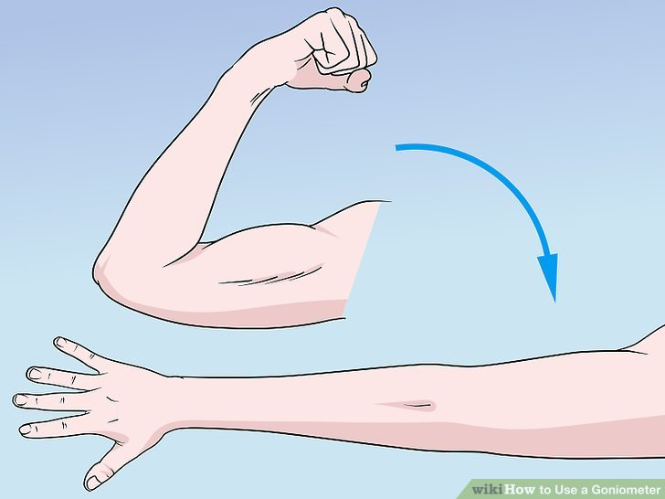

# PT-Motion
PT-motion an an application that helps patients in recovery through gamification  

low intensity phisiothrepy in what it helps patients in . 
it allows the monitering of patients recovery. 
we use the phones accelerometer and gyro to get the values of range of motion of a joint  

##how it works
1. patients download the pt motion app
2.patients login into pt motion and start 
3. using the phones accelerometer and gyroscope the respective readings are obtained
4. thorugh Mathematical Modelling the goals and healing factor is obtained

##technology behing it
- pt motion is not a dumb rule engine based application
- the goals calculated for the patient is dynamic
- we have implemented method of least squares and other mathematical modelling techiniques to do this
- bases on the previous sessions the patient used the app the goals are changed

